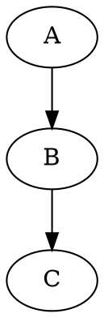

# Extension Tests

## Graphviz (inline)

```graphviz
digraph G {
    A -> B -> C;
}
```

## Truly Sane Lists

- Item 1
  - Nested with 2-space indent
  - Should render correctly
- Item 2

## Emoji

:thumbsup: :rocket:
